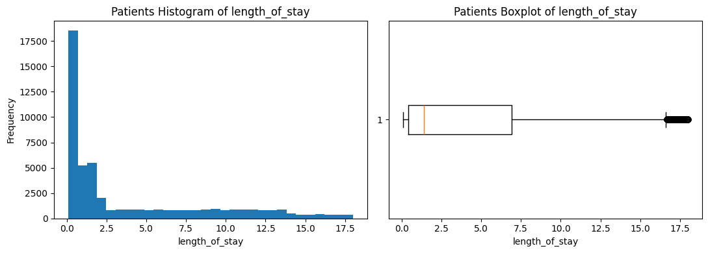
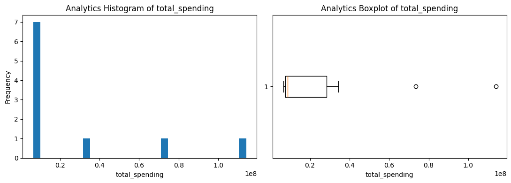
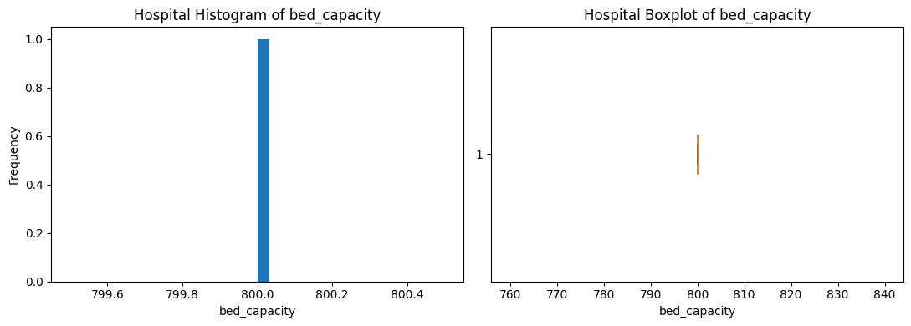

# 📊 Hospital Analytics Dataset 


This project analyzes hospital datasets and generates summary statistics (mean, median) for key metrics across multiple data sources.

---

## 📑 Table of Contents
- [🚀 Project Setup](#-project-setup)  
- [📊 Metadata Documentation](#-hospital-analytics-metadata-documentation)  
  - [Patients Dataset](#-patients-dataset)  
  - [Supply Chain Dataset](#-supply-chain-dataset)  
  - [Analytics Dataset](#-analytics-dataset)  
  - [Hospital Dataset](#-hospital-dataset)  
  - [Inventory Dataset](#-inventory-dataset)  
  - [Transactions Dataset](#-transactions-dataset)  
- [📌 Summary](#-summary)  
- [📊 Plots](#-plots)  
- [🔎 Exploratory Data Analysis (EDA) & Data Preprocessing](#-exploratory-data-analysis-eda--data-preprocessing)  
  - [Step 1: Descriptive Statistics](#-step-1-descriptive-statistics-mean--median)  
  - [Step 2: Outlier Detection](#-step-2-outlier-detection)  
  - [Step 3: Missing Value Handling](#-step-3-missing-value-handling)  
  - [Step 4: Visualization](#-step-4-visualization)  
  - [Key Insights](#-key-eda-insights)  

---

## 🚀 Project Setup

### 1. Create Project Folder
```bash
mkdir hospital_analytics_1
cd hospital_analytics_1
```

### 2. Create a Virtual Environment
```bash
python -m venv my_env
```

### 3. Activate the Environment
- On **Windows**:
```bash
my_env\Scripts\activate
```

### 4. Install Dependencies
```bash
pip install pandas openpyxl tabulate
```

### 5. Run the Code
Save the script as `ANALYTICS.PY` and run:
```bash
python ANALYTICS.PY
```

---

# 📊 Hospital Analytics Metadata Documentation  

This section describes the important columns from each dataset.

---

## 🧑‍⚕️ Patients Dataset
- **length_of_stay**: Number of days a patient spends in the hospital.  
- **complexity_score**: Medical complexity score (higher = more complex cases).  
- **age**: Patient’s age in years.  
- **gender**: Patient’s gender (Male/Female).  

**Insight**: Useful for analyzing hospitalization patterns and resource utilization.

---

## 🚚 Supply Chain Dataset
- **ordered_quantity**: Units ordered by the hospital.  
- **unit_price**: Price per unit.  
- **total_value**: `ordered_quantity × unit_price`.  
- **supplier_id**: Supplier identifier.  

**Insight**: Helps track procurement and spending patterns.

---

## 📈 Analytics Dataset
- **total_spending**: Total expenditure.  
- **avg_transaction_cost**: Average cost per transaction.  
- **transaction_count**: Number of transactions.  
- **revenue_lost**: Estimated financial losses.  
- **formulary_adherence_pct**: Compliance with medical formulary.  

**Insight**: Useful for financial efficiency tracking.

---

## 🏥 Hospital Dataset
- **bed_capacity**: Total hospital beds.  
- **annual_budget**: Yearly budget allocation.  
- **departments**: Number of departments.  

**Insight**: Reflects hospital scale and service capacity.

---

## 📦 Inventory Dataset
- **current_stock**: Items in stock.  
- **days_of_stock**: Days stock will last.  
- **stock_value**: Value of stock.  
- **turnover_rate**: Frequency of replenishment.  

**Insight**: Supports inventory efficiency analysis.

---

## 💳 Transactions Dataset
- **quantity_consumed**: Units consumed.  
- **unit_cost**: Cost per unit.  
- **total_cost**: `quantity_consumed × unit_cost`.  
- **revenue_lost**: Loss due to inefficiencies.  

**Insight**: Tracks micro-level costs and inefficiencies.

---

## 📌 Summary
- **Patients** → Care delivery & complexity.  
- **Supply Chain & Inventory** → Resource availability & cost.  
- **Analytics & Transactions** → Financial efficiency.  
- **Hospital** → Structural capacity.  

---

## 📊 Plots
### Patients

### Supply Chain


### Analytics

### Hospital

### Inventory

### Transactions


---

# 🔎 Exploratory Data Analysis (EDA) & Data Preprocessing  


---

## 📊 Step 1: Descriptive Statistics (Mean & Median)

### 🧑‍⚕️ Patients Dataset
- **length_of_stay** → Mean: `3.94`, Median: `1.40`  
- **complexity_score** → Mean: `1.40`, Median: `1.30`  

### 🚚 Supply Chain Dataset
- **ordered_quantity** → Mean: `469.02`, Median: `270.20`  
- **unit_price** → Mean: `56.53`, Median: `39.85`  
- **total_value** → Mean: `25,424.14`, Median: `10,019.88`  

### 📈 Analytics Dataset
- **total_spending** → Mean: `27,831,281.20`, Median: `8,706,416.01`  
- **avg_transaction_cost** → Mean: `245.91`, Median: `231.45`  
- **transaction_count** → Mean: `109,211.90`, Median: `33,710.00`  
- **revenue_lost** → Mean: `3,398,097.32`, Median: `805,641.69`  

### 🏥 Hospital Dataset
- **bed_capacity** → Mean: `800.00`, Median: `800.00`  
- **annual_budget** → Mean: `960,000,000.00`, Median: `960,000,000.00`  

### 📦 Inventory Dataset
- **current_stock** → Mean: `42.86`, Median: `43.48`  
- **days_of_stock** → Mean: `15.07`, Median: `10.20`  
- **stock_value** → Mean: `2,455.55`, Median: `1,521.29`  
- **turnover_rate** → Mean: `63.66`, Median: `35.76`  

### 💳 Transactions Dataset
- **quantity_consumed** → Mean: `4.27`, Median: `3.00`  
- **unit_cost** → Mean: `64.93`, Median: `42.21`  
- **total_cost** → Mean: `254.16`, Median: `138.38`  
- **revenue_lost** → Mean: `31.04`, Median: `0.00`  

---

## 📉 Step 2: Outlier Detection
- Used **Boxplots** to detect anomalies.  
- Example: `unit_price` shows extreme outliers.  

---

## 📦 Step 3: Missing Value Handling
- Missing numeric values → Replaced with **median**.  
- Columns with >30% missing data → Dropped.  

---

## 📊 Step 4: Visualization
- Created **Histograms & Boxplots** for all critical metrics.  
- Saved in the `charts/` folder.  

---

## ✅ Key EDA Insights
- **Patients**: Short stays dominate; a few very long stays skew averages.  
- **Supply Chain**: Suppliers with very high unit prices raise costs.  
- **Analytics**: Revenue lost is heavily skewed by a few big inefficiencies.  
- **Hospital**: Stable bed capacity & budget.  
- **Inventory**: Overstocking in certain items.  
- **Transactions**: A few high-cost cases inflate mean costs.  

---


